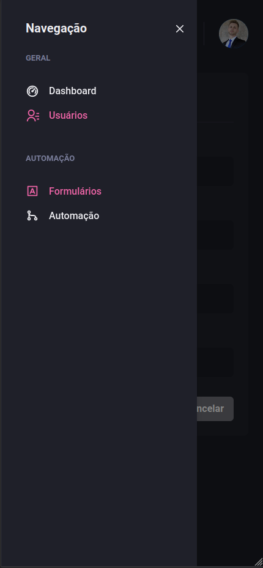
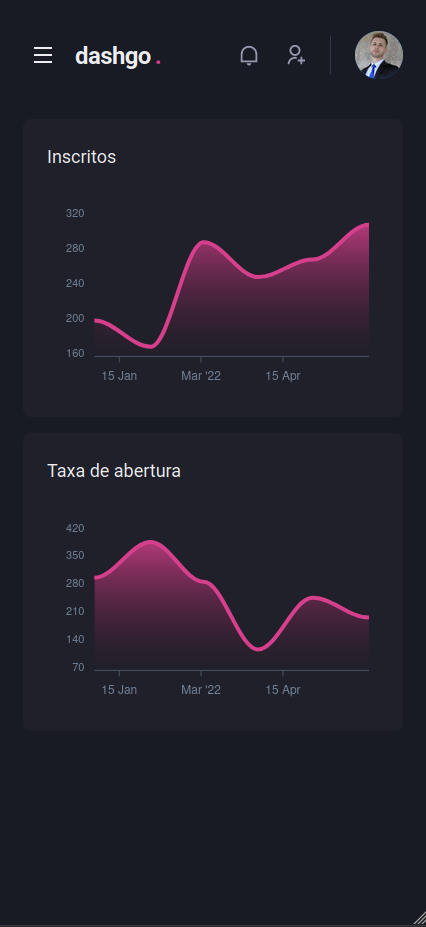
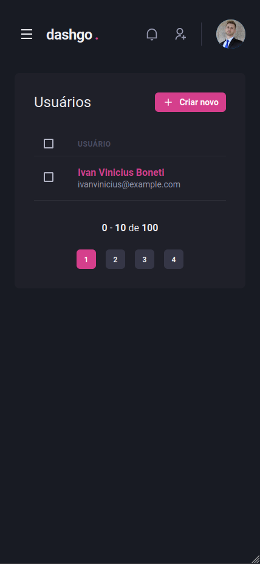
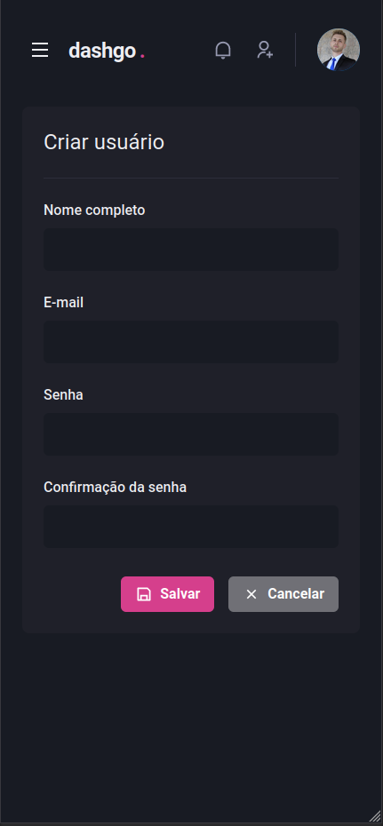
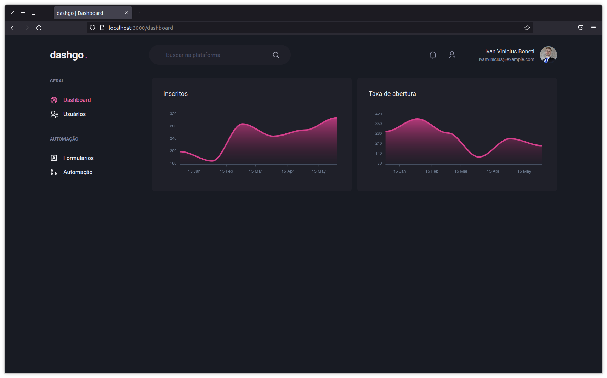
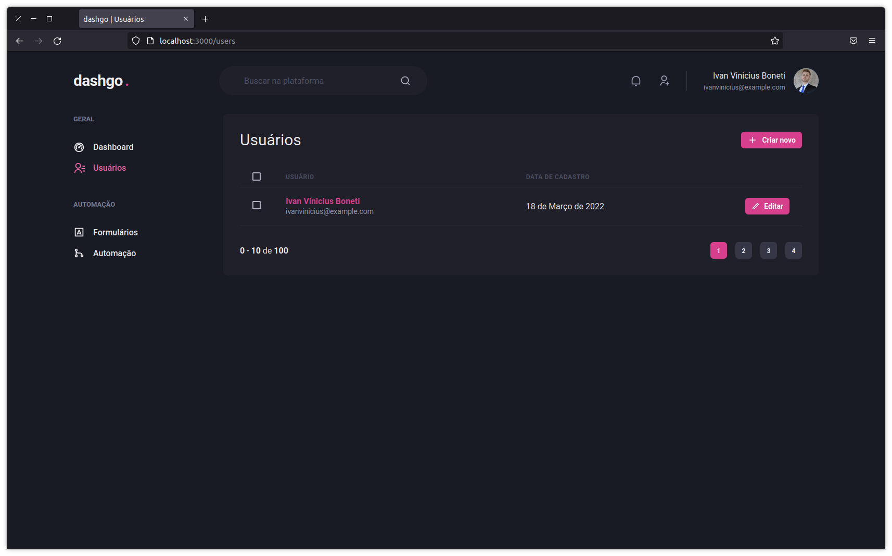
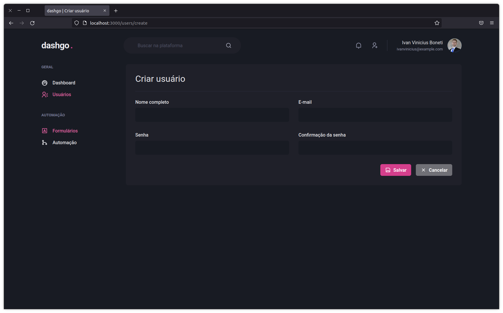

<div id="top" align="center">
  <div>
    
  </div>
  <h4 align="center">dashgo. | Responsive futuristic dashboard that blows your mind.</h4>
</div>

## Resumo

  <ol>
    <li><a href="#visão-geral-do-projeto">Visão geral do projeto</a></li>
    <li><a href="#sobre-o-projeto">Sobre o projeto</a></li>
    <li><a href="#tecnologias-utilizadas">Tecnologias utilizadas</a></li>
    <li><a href="#instalação-e-utilização">Instalação e utilização</a></li>
    <li><a href="#licença">Licença</a></li>
    <li><a href="#agradecimentos">Agradecimentos</a></li>
  </ol>

## Visão geral do projeto

Versão responsiva para celulares
<div align="center">
   
    
    
    
</div>

<div align="center">
    
    
    
</div>

## Sobre o projeto

dashgo. é um dashboard muito bonito, construido usando interface declarativa, tecnologia do futuro.

## Tecnologias utilizadas

As principais tecnologias utilizadas na construção deste projeto foram: 

* [Next.js](https://nextjs.org/)
* [Chakra UI](https://chakra-ui.com/guides/getting-started/nextjs-guide)

## Instalação e utilização

Instruções de instalação do projeto em seu computador.

### Pré-requisitos

Clone este repositório utilizando o comando a seguir. Lembre-se, você deve possuir a CLI do git instalada em seu computador.

```sh
git clone https://github.com/ivanvinicius/dashgo.git
```
Para que seja possível fazer o download das depêdencias do projeto, recomendamos a utilização de um package mananger:

* [Yarn (Recomendado para este projeto)](https://classic.yarnpkg.com/lang/en/docs/install/#debian-stable)
* [Npm](https://nodejs.org/en/)
  
### Instalação

1. Dentro da pasta do projeto, rode o comando ```yarn``` para fazendo o download da depêndencias.

2. Na raiz do projeto crie o arquivo ```env.local```, onde ficarão as variáveis ambiente da aplicação. Então copie todo o conteúdo do arquivo ```env.example```.

3. Sessão incompleta até o momento.

## Licença

 O projeto ainda não contém nenhuma licença. ⚠️

## Agradecimentos

* [Rocketseat Education - Boosting People.](https://www.rocketseat.com.br/)
* [Diego Fernandes - Github Profile.](https://github.com/diego3g/)

<br/>
<h4 align="center"><a href="#top">Voltar ao Início</a></h4>

<p align="right">"Estabilidade não existe" - Flavio Augusto</p>